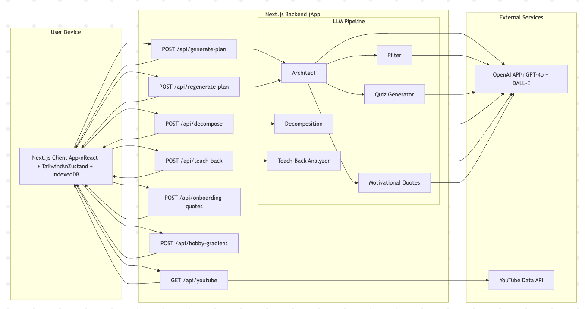

# SideQuest

SideQuest is a calm, local-first learning companion that helps you pick a hobby and focus on *just the few techniques that matter most* (usually 5–8). Instead of sending you down endless rabbit holes, it nudges you toward practice, progress, and mastery.


## UI Video Demo

[Watch the UI demo](https://youtu.be/fR21z4WDIww)

## HLD




## What it does 

- **AI-generated learning plans**: creates a curated set of techniques for your hobby + goal + time budget.
- **Tasteful AI hobby image**: the home hero uses an AI-generated image stored as a base64 data URL so it doesn’t expire.
- **Learning flow per technique**:
  - **Learn**: YouTube tutorials (via the app’s API) and a short “I have learnt enough” CTA to move forward.
  - **Quiz**: a short quiz tied to the technique content.
  - **Flashcards**: swipeable flashcards after the quiz for reinforcement.
  - **Practice**: lightweight practice tracking with a “Mark as Mastered” action.
  - **Teach Back**: voice-based “teach back” with AI feedback.
- **Progressive unlocking**: later techniques stay locked until earlier ones are mastered.
- **“Too Hard” decomposition**: break a technique into smaller sub-techniques (AI-generated) and continue from there.
- **Multi-hobby support**: create multiple plans and switch between them (mobile + desktop UI).
- **Light + dark mode**: theme toggle across the app.
- **Celebrations**: confetti + completion feedback when you finish techniques / a full plan.
- **Local-first persistence**: plans are stored in **IndexedDB** (prevents localStorage quota issues with images).


## Tech overview 

- **Framework**: Next.js (App Router)
- **Language**: TypeScript
- **UI**: Tailwind CSS + Radix primitives
- **State**: Zustand
- **AI**: OpenAI SDK with Zod-validated structured outputs
- **Storage**: IndexedDB (via `idb-keyval`)


## Project setup

### Prerequisites

- **Node.js**: 20.19+ or 22.12+
- **npm**: 10+

### 1) Install dependencies

```bash
npm install
```

### 2) Configure environment variables

Create a file named `.env.local` in the project root:

```bash
OPENAI_API_KEY=your_openai_key_here
# Optional (enables YouTube video enrichment)
YOUTUBE_API_KEY=your_youtube_key_here
```

Notes:
- The app **requires** `OPENAI_API_KEY` to generate plans.
- If `YOUTUBE_API_KEY` is not set, the app should still work, but video resources may be missing.

### 3) Run the dev server

```bash
npm run dev
```

Then open:

- `http://localhost:3000`


## Common scripts

- **Development**: `npm run dev`
- **Production build**: `npm run build`
- **Start production server**: `npm run start`

## High-level structure

- `src/app/`: Next.js App Router pages and API routes (`src/app/api/*/route.ts`)
- `src/components/`: UI + feature components (layout, onboarding, learning, modals, etc.)
- `src/stores/`: Zustand stores (learning plans, UI state, theme, sync)
- `src/lib/`: AI/LLM pipeline utilities, YouTube helpers, local persistence helpers
- `public/`: Lottie animations and other static assets


